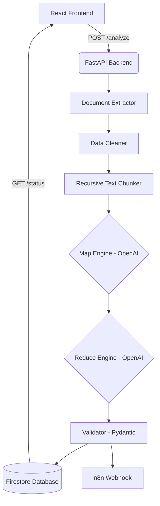

# Meeting Transcript Action Item Extractor 🚀

A full-stack, AI-powered SaaS application that ingests massive meeting transcripts (PDF, DOCX, TXT) and intelligently extracts highly accurate Action Items using an OpenAI Map-Reduce pipeline.

## 🌟 Key Features

### 🧠 Advanced AI Map-Reduce Pipeline
- **Map Phase**: Safely chunks large, unstructured transcripts (up to hours of meetings) and extracts contextual action items in parallel without losing information to context window limits.
- **Reduce Phase**: Merges, deduplicates, and standardizes the action items into a clean, actionable final list.
- Uses strict Pydantic structured outputs to guarantee perfect JSON delivery every time.

### ⚡ Blazing Fast FastAPI Backend
- Fully async backend architecture using FastAPI.
- Uses `BackgroundTasks` to handle the heavy Map-Reduce pipeline asynchronously, allowing the client to return immediately and poll for status.
- **State Management**: Integrated natively with **Firebase Firestore** to track background job states statelessly, making it perfectly suited for serverless deployments on Google Cloud Run.
- Built-in document extraction supporting `.pdf` (PyMuPDF), `.docx` (python-docx), and raw `.txt`.
- Native webhook delivery (e.g., to n8n) upon job completion!

### 🎨 Beautiful React + Vite Frontend
- Modern, hyper-aesthetic SaaS dashboard built with React and Vite.
- Styled with **Tailwind CSS v4** and Phosphor Icons for a clean, glassmorphic UI.
- File upload drag-and-drop zones, smooth loading animations, and polling mechanisms built-in.

---

## 🏗️ System Architecture



---

## 🚀 Getting Started (Local Development)

### 1. Backend Setup
```bash
# Navigate to project root
cd transcript_maker

# Create and activate virtual environment
python -m venv venv
.\venv\Scripts\activate  # Windows
source venv/bin/activate # Mac/Linux

# Install dependencies
pip install -r requirements.txt

# Create .env file
echo "OPENAI_API_KEY=your_key" > .env
echo "N8N_WEBHOOK_URL=your_webhook" >> .env
echo "GOOGLE_APPLICATION_CREDENTIALS=path/to/firebase/key.json" >> .env

# Run FastAPI Server
uvicorn main:app --reload --port 8000
```

### 2. Frontend Setup
```bash
# Navigate to frontend folder
cd frontend

# Install dependencies
npm install

# Run Vite Dev Server
npm run dev
```

---

## ☁️ Deployment (Google Cloud Run + Firebase Hosting)

This project is containerized and ready for serverless scaling.

1. **Backend (Google Cloud Run)**:
   Deploy the FastAPI backend directly from source:
   ```bash
   gcloud run deploy transcript-api \
     --source . \
     --region us-central1 \
     --allow-unauthenticated \
     --set-env-vars OPENAI_API_KEY=your_key,N8N_WEBHOOK_URL=your_webhook
   ```
   *(Note: The Cloud Run service account automatically integrates with Firestore without needing the local JSON key).*

2. **Frontend (Firebase Hosting)**:
   Set your Cloud Run URL in the frontend, build, and push to Firebase:
   ```bash
   cd frontend
   echo "VITE_API_BASE_URL=https://<your-cloud-run-url>/api/v1" > .env.production
   npm run build
   firebase deploy --only hosting
   ```

---

## 📂 Project Structure

- `/app` - The core AI pipeline (chunking, mapping, reducing, validation, webhooks).
- `/frontend` - The React SPA.
- `main.py` - FastAPI entry point and Firestore integration.
- `Dockerfile` - Cloud Run container specification.
- `firebase.json` - Firebase Hosting routing rules.
